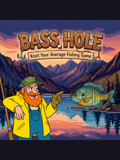

# Bass Hole

**"Knot Your Average Fishing Game"**



An open-source Insaniquarium-style game for the ESP32 CYD (Cheap Yellow Display). Feed fish, collect coins, and survive the sass of Ty Knotts - the grumpiest largemouth bass guide in Northern California.


<!-- TODO: Add gameplay gif here -->
<!--  -->

## About This Project

Bass Hole is designed as both a playable game and an **educational reference** for ESP32 CYD game development. The codebase demonstrates:

- Touch input handling on CYD hardware
- Game state management
- Entity systems (fish, food, coins)
- SD card save/load functionality
- Simple 2D rendering with TFT_eSPI
- Modular code architecture for embedded games

Whether you want to play the game, learn ESP32 game development, or fork it to build your own - welcome aboard.

## Features

### Current (Phase 1) - **Hardware Verified!**
- [x] Core gameplay loop (feed fish → collect coins)
- [x] Fish AI with hunger, growth, and coin generation
- [x] Touch input (Verified on TZT CYD 2.4")
- [x] Multiple fish species with unique stats
- [x] Game state save/load to SD card
- [x] Corrected Display/Color configuration for CYD
- [x] Simple shape-based graphics

### Planned

- [ ] Sprite-based graphics (16-color dithered fish)
- [ ] Ty Knotts narrator with dialogue system
- [ ] Enemy fishermen (Clankers, Cogsuckers)
- [ ] Boss battles with AI parody characters
- [ ] Shop system for upgrades
- [ ] Sound effects via ESP32 DAC
- [ ] Particle effects

## Hardware Requirements

| Component | Specification |
|-----------|---------------|
| Board | ESP32 CYD 2.4" (TZT/Sunton) |
| Display | ILI9341 320x240 LCD (Landscape) |
| Touch | XPT2046 resistive |
| Storage | MicroSD card (FAT32) |

**Tested & Verified on:** TZT ESP32 LVGL WiFi & Bluetooth 2.4" LCD TFT Module  
**Display Mode:** Landscape (320x240, USB on left, verified 2026-01-20)  
**Touch:** HSPI bus, X/Y swapped mapping  
**Performance:** 30+ FPS stable

> ⚙️ **Configuration Reference:** See `LANDSCAPE_CONFIG_LOCKED.md` in artifacts directory for complete hardware setup.

Other 2.4" CYD variants should work with minor pin adjustments. See [docs/HARDWARE.md](docs/HARDWARE.md) for pinout details.

## Quick Start

### 1. Clone the Repository

```bash
git clone https://github.com/boxwrench/Bass-Hole.git
cd Bass-Hole
```

### 2. PlatformIO (Recommended)

1. Open the project folder in **VS Code**.
2. Install the **PlatformIO** extension.
3. Click the **PlatformIO** icon in the sidebar.
4. Under `Project Tasks`, click **Build** to compile.
5. Click **Upload** to flash your device.

**Note:** Dependencies (`TFT_eSPI`, `XPT2046`) are automatically managed via `platformio.ini`.

### 3. Play!

- **Tap the tank** to drop food
- **Tap coins** to collect them
- **Don't let your fish starve!**

## Project Structure

```text
Bass-Hole/
├── src/                    # Source code
│   └── main.cpp            # Main entry point (formerly BassHole.ino)
├── include/                # Header files
│   ├── config.h            # Hardware pins & game constants
│   ├── game_state.h        # State machine, save/load checks
│   ├── fish.h              # Fish entity system
│   ├── food.h              # Food pellet system
│   ├── coins.h             # Coin system
│   ├── touch.h             # Touch input handling
│   ├── graphics.h          # Rendering layer
│   └── sdcard.h            # SD card operations
├── platformio.ini          # Project configuration & dependencies
├── assets/                 # Art assets (sprites, backgrounds)
├── tools/                  # Asset conversion scripts
├── docs/                   # Documentation
│   ├── ARCHITECTURE.md     # Code structure explained
│   ├── HARDWARE.md         # CYD basics & pinouts
│   ├── CYD_VARIANTS.md     # Tested board configurations
│   ├── ADDING_FISH.md      # Tutorial: add new fish species
│   └── ASSETS.md           # Sprite creation guide
├── sdcard/                 # Files to copy to SD card
├── SETUP.md                # Detailed setup instructions
├── CONTRIBUTING.md         # How to contribute
├── LICENSE                 # MIT License
└── README.md               # You are here
```

## Documentation

| Document | Description |
|----------|-------------|
| [SETUP.md](SETUP.md) | Detailed installation & troubleshooting |
| [docs/ARCHITECTURE.md](docs/ARCHITECTURE.md) | How the code is organized |
| [docs/HARDWARE.md](docs/HARDWARE.md) | CYD basics, pinouts, mods |
| [docs/CYD_VARIANTS.md](docs/CYD_VARIANTS.md) | **Tested board configs** - check here first! |
| [docs/ADDING_FISH.md](docs/ADDING_FISH.md) | Tutorial: Add a new fish species |
| [docs/ASSETS.md](docs/ASSETS.md) | Creating & converting sprites |
| [DEVELOPMENT_STRATEGY.md](DEVELOPMENT_STRATEGY.md) | Full game design document |

## Contributing

Contributions are welcome! See [CONTRIBUTING.md](CONTRIBUTING.md) for guidelines.

**Good first issues:**
- Add new fish species
- Improve touch calibration
- Add screen shake effects
- Write Ty Knotts dialogue

## Game Design

**Narrator:** Ty Knotts - A grumpy largemouth bass who guides players with terse, sarcastic commentary. Think Ron Swanson as a fishing guide.

**Visual Style:**
- Fish: 16-color dithered realistic sprites
- Characters: Bold cartoon style
- UI: Clean pixel art

**NorCal Theme:** All fish species are native to Northern California waters.

See [DEVELOPMENT_STRATEGY.md](DEVELOPMENT_STRATEGY.md) for the complete design document.

## Tech Stack

- **MCU:** ESP32-WROOM-32
- **IDE:** Cursor with PlatformIO Extension (Recommended)
- **Display:** ILI9341 via TFT_eSPI
- **Touch:** XPT2046 resistive touchscreen
- **Storage:** SD card via SPI
- **Language:** C++ (Arduino framework)

## License

This project is licensed under the MIT License - see [LICENSE](LICENSE) for details.

## Acknowledgments

- Inspired by [Insaniquarium](https://en.wikipedia.org/wiki/Insaniquarium) by PopCap Games
- Built for the ESP32 CYD community
- TFT_eSPI library by [Bodmer](https://github.com/Bodmer/TFT_eSPI)

---

*"You call that feeding? My grandma casts better."* - Ty Knotts
